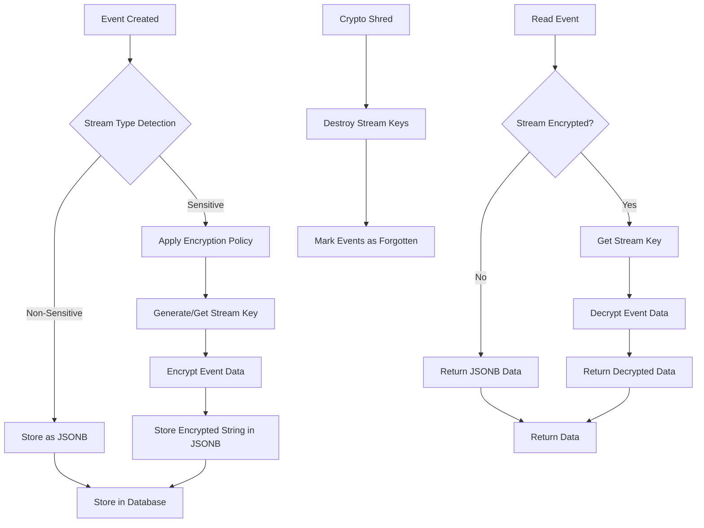

# Crypto Shredding Implementation

**Status:** ✅ Implemented  
**Version:** 1.0  
**Last Updated:** 2025-01-27  
**Package:** `@wataruoguchi/emmett-crypto-shredding`

> **Note:** This document describes the implementation plan and architecture. The core functionality has been implemented in the `@wataruoguchi/emmett-crypto-shredding` package.  

---

## Table of Contents

1. [Executive Summary](#executive-summary)
2. [Architecture Overview](#architecture-overview)
3. [Database Schema Changes](#database-schema-changes)
4. [Implementation Phases](#implementation-phases)
5. [API Design](#api-design)
6. [Security Considerations](#security-considerations)
7. [Testing Strategy](#testing-strategy)
8. [Migration Plan](#migration-plan)
9. [Documentation](#documentation)
10. [Library Packaging & Compatibility](#library-packaging--compatibility)

---

## Executive Summary

### What This Feature Does

Implement **crypto shredding** (cryptographic erasure) for the Emmett event store, enabling:

- **Selective encryption** of event streams based on data classification
- **Per-stream encryption** with automatic key management
- **Crypto shredding** - destroy encryption keys to make data unrecoverable
- **Key rotation** with historical decryption support
- **GDPR/CCPA compliance** for "right to be forgotten" requests

### Core Use Cases

1. **Compliance**: Encrypt sensitive streams (user data, PII, financial data)
2. **Data Minimization**: Only encrypt what needs protection
3. **Crypto Shredding**: Forget tenant data by destroying keys
4. **Key Management**: Rotate keys while maintaining decryption capability
5. **Performance**: Non-sensitive streams remain unencrypted for speed

### Key Architectural Decisions

| Decision | Rationale | Impact |
|----------|-----------|---------|
| **Per-Stream Encryption** | Events in streams are logically related (same aggregate) | Better performance, simpler key management |
| **Selective Encryption** | Only encrypt sensitive data types | Compliance + performance balance |
| **Keep Old Keys** | Enable decryption of historical events | Required for event sourcing |
| **Algorithm on Streams** | Algorithm is a stream property, not key property | Easier key rotation and migration |
| **Encrypted Key Material** | Keys encrypted with master key before storage | Database compromise doesn't expose keys |

---

## Architecture Overview

### High-Level Flow



### Component Architecture

```typescript
// Core Components
interface CryptoShreddingService {
  encryptEventData(data: unknown, streamId: string, tenantId: string): Promise<string>;
  decryptEventData(encryptedData: string, streamId: string, tenantId: string): Promise<unknown>;
  forgetTenantData(tenantId: string): Promise<void>;
  rotateStreamKey(streamId: string, tenantId: string): Promise<void>;
}

interface EncryptionPolicyService {
  getPolicyForStream(streamId: string, tenantId: string, eventTypes: string[]): Promise<StreamEncryptionPolicy | null>;
  createPolicy(policy: StreamEncryptionPolicy): Promise<void>;
  updatePolicy(policyId: string, updates: Partial<StreamEncryptionPolicy>): Promise<void>;
}

interface KeyManagementService {
  generateStreamKey(tenantId: string, streamId: string): Promise<string>;
  getStreamKey(streamId: string, tenantId: string): Promise<string>;
  destroyTenantKeys(tenantId: string): Promise<void>;
  rotateStreamKey(streamId: string, tenantId: string): Promise<void>;
}
```

---

## Database Schema Changes

### 1. Encryption Keys Table

```sql
CREATE TABLE encryption_keys (
  key_id VARCHAR(100) PRIMARY KEY,
  tenant_id VARCHAR(100) NOT NULL,
  key_material BYTEA NOT NULL, -- Encrypted key material
  key_version INTEGER DEFAULT 1,
  created_at TIMESTAMP WITH TIME ZONE DEFAULT NOW(),
  destroyed_at TIMESTAMP WITH TIME ZONE,
  is_destroyed BOOLEAN DEFAULT false,
  is_active BOOLEAN DEFAULT true,
  
  INDEX idx_encryption_keys_tenant (tenant_id),
  INDEX idx_encryption_keys_active (is_active, is_destroyed)
);
```

### 2. Encryption Policies Table

**Note:** Key usage history is tracked directly in message metadata. Each encrypted message stores `keyId` and `keyVersion` in `metadata.enc`, allowing queries to determine which keys were used at which stream positions without a separate history table.

```sql
CREATE TABLE encryption_policies (
  policy_id VARCHAR(100) PRIMARY KEY,
  stream_type_class VARCHAR(100) NOT NULL,
  tenant_id VARCHAR(100) NOT NULL,
  encryption_required BOOLEAN NOT NULL,
  encryption_algorithm VARCHAR(50),
  key_rotation_interval_days INTEGER,
  created_at TIMESTAMP WITH TIME ZONE DEFAULT NOW(),
  updated_at TIMESTAMP WITH TIME ZONE DEFAULT NOW(),
  
  INDEX idx_encryption_policies_stream_type (stream_type_class, tenant_id)
);
```

### 3. Streams Table Updates

```sql
-- Add encryption configuration to streams
ALTER TABLE streams ADD COLUMN encryption_key_id VARCHAR(100);
ALTER TABLE streams ADD COLUMN encryption_algorithm VARCHAR(50) DEFAULT 'AES-256-GCM';
ALTER TABLE streams ADD COLUMN is_encrypted BOOLEAN DEFAULT false;
ALTER TABLE streams ADD COLUMN stream_type_class VARCHAR(100);
ALTER TABLE streams ADD COLUMN key_rotation_count INTEGER DEFAULT 0;
ALTER TABLE streams ADD COLUMN last_key_rotation TIMESTAMP WITH TIME ZONE;

-- Add foreign key constraint
ALTER TABLE streams ADD CONSTRAINT fk_streams_encryption_key 
  FOREIGN KEY (encryption_key_id) REFERENCES encryption_keys(key_id);
```

---

## Implementation Phases

### Phase 1: Foundation (2-3 weeks)

**Goal:** Basic encryption infrastructure

**Features:**

- ✅ Core encryption/decryption utilities
- ✅ Key management service
- ✅ Database schema migration
- ✅ Basic event store integration
- ✅ Unit tests for crypto functions

**Deliverables:**

- `CryptoShreddingService` implementation
- `KeyManagementService` implementation
- Database migration scripts
- Basic event store encryption support

### Phase 2: Selective Encryption (2-3 weeks)

**Goal:** Stream classification and policy management

**Features:**

- ✅ Stream type detection
- ✅ Encryption policy management
- ✅ Auto-detection in event store
- ✅ Policy-based encryption decisions
- ✅ Tenant-specific policies

**Deliverables:**

- `EncryptionPolicyService` implementation
- Stream type detection logic
- Policy management API
- Enhanced event store interface

### Phase 3: Key Rotation (1-2 weeks)

**Goal:** Key lifecycle management

**Features:**

- ✅ Key rotation with historical support
- ✅ Stream key history tracking
- ✅ Automatic key rotation
- ✅ Key cleanup and destruction

**Deliverables:**

- Key rotation implementation
- Historical decryption support
- Key lifecycle management
- Cleanup utilities

### Phase 4: Crypto Shredding (1-2 weeks)

**Goal:** Data forgetting capabilities

**Features:**

- ✅ Tenant data forgetting
- ✅ Stream-level forgetting
- ✅ Key destruction
- ✅ Audit trail for destruction

**Deliverables:**

- Crypto shredding implementation
- Data forgetting API
- Audit trail for key destruction
- Compliance reporting

### Phase 5: Integration & Testing (1-2 weeks)

**Goal:** Production-ready implementation

**Features:**

- ✅ Integration tests
- ✅ Performance testing
- ✅ Security testing
- ✅ Documentation
- ✅ Example implementations

**Deliverables:**

- Comprehensive test suite
- Performance benchmarks
- Security audit
- Complete documentation
- Example project updates

---

## API Design

### Open-Closed Plugin Design (Recommended)

To preserve the Open-Closed principle, implement crypto shredding as a non-invasive decorator around the existing event store. The base event store remains unchanged; the plugin composes it and exposes the same interface.

Key ideas:

- No core changes required to `KyselyEventStore` or its consumers.
- Per-domain opt-in by injecting the decorated store only where needed.
- Encryption metadata is embedded alongside events; decryption is transparent to readers.
- Consumers and projections can be adapted via an optional decrypt hook.

```ts
// Decorator preserves the public surface of the event store
export interface CryptoEventStore extends KyselyEventStore {}

export type EncryptionMetadata = {
  enc: {
    algo: 'AES-256-GCM' | 'ChaCha20-Poly1305' | 'AES-GCM-SIV';
    keyId: string;           // Logical key identifier
    keyVersion: number;      // Monotonic per keyId
    iv: string;              // Base64/hex-encoded nonce/IV
    aadHash?: string;        // Optional hash of AAD for auditing
  };
};

export type CryptoContext = {
  tenantId: string;
  streamId: string;
  streamType?: string;
  eventType?: string;
};

export interface EncryptionPolicyResolver {
  resolve(ctx: CryptoContext): Promise<
    | { encrypt: true; algo: 'AES-256-GCM' | 'ChaCha20-Poly1305'; keyRef: string }
    | { encrypt: false }
  >;
}

export interface KeyManagement {
  getActiveKey(params: { tenantId: string; keyRef: string }): Promise<{
    keyId: string;           // e.g., kms://tenant/… or DB row id
    keyVersion: number;
    keyBytes: Uint8Array;    // DEK (unwrapped) for data encryption
  }>;
  rotateKey(params: { tenantId: string; keyRef: string }): Promise<{ keyId: string; keyVersion: number }>;
  destroyTenantKeys(tenantId: string): Promise<void>; // Crypto shred
}

export interface CryptoProvider {
  encrypt(
    algo: 'AES-256-GCM' | 'ChaCha20-Poly1305',
    key: Uint8Array,
    iv: Uint8Array,
    plaintext: Uint8Array,
    aad?: Uint8Array,
  ): Promise<Uint8Array>;
  decrypt(
    algo: 'AES-256-GCM' | 'ChaCha20-Poly1305',
    key: Uint8Array,
    iv: Uint8Array,
    ciphertext: Uint8Array,
    aad?: Uint8Array,
  ): Promise<Uint8Array>;
}

export type DecryptHook = (
  event: ReadEvent<Event, ReadEventMetadataWithGlobalPosition>,
) => Promise<ReadEvent<Event, ReadEventMetadataWithGlobalPosition>>;

export function createCryptoEventStore(
  base: KyselyEventStore,
  deps: {
    policy: EncryptionPolicyResolver;
    keys: KeyManagement;
    crypto: CryptoProvider;
    buildAAD?: (ctx: CryptoContext) => Uint8Array; // Optional: bind tenant/stream/version
  },
): CryptoEventStore {
  // Implementation wraps appendToStream/readStream and (de)crypts based on policy
  return {
    ...base,
    async appendToStream(streamName, events, options) {
      const processed = await Promise.all(
        events.map(async (e) => {
          const ctx: CryptoContext = {
            tenantId: String((options as any)?.partition ?? 'default_partition'),
            streamId: streamName,
            streamType: (options as any)?.streamType,
            eventType: e.type,
          };
          const decision = await deps.policy.resolve(ctx);
          if (decision.encrypt) {
            const { keyId, keyVersion, keyBytes } = await deps.keys.getActiveKey({
              tenantId: ctx.tenantId,
              keyRef: decision.keyRef,
            });
            const iv = crypto.getRandomValues(new Uint8Array(12));
            const aad = deps.buildAAD?.(ctx);
            const ciphertext = await deps.crypto.encrypt(
              decision.algo,
              keyBytes,
              iv,
              new TextEncoder().encode(JSON.stringify(e.data)),
              aad,
            );
            return {
              ...e,
              data: Buffer.from(ciphertext).toString('base64'),
              metadata: {
                ...(e as any).metadata,
                enc: { algo: decision.algo, keyId, keyVersion, iv: Buffer.from(iv).toString('base64') },
              } as EncryptionMetadata,
            } as Event;
          }
          return e;
        }),
      );
      return base.appendToStream(streamName, processed as any, options as any);
    },
    async readStream(streamName, options) {
      const res = await base.readStream(streamName, options as any);
      const tenantId = String((options as any)?.partition ?? 'default_partition');
      const events = await Promise.all(
        res.events.map(async (ev) => {
          if (!ev) return ev;
          const meta = (ev as any).metadata?.enc as EncryptionMetadata['enc'] | undefined;
          if (!meta) return ev;
          const { keyBytes } = await deps.keys.getActiveKey({ tenantId, keyRef: meta.keyId });
          const aad = deps.buildAAD?.({ tenantId, streamId: String((ev as any).metadata?.streamId ?? streamName) });
          const plaintext = await deps.crypto.decrypt(
            meta.algo as any,
            keyBytes,
            Buffer.from(meta.iv, 'base64'),
            Buffer.from(String(ev.data), 'base64'),
            aad,
          );
          return { ...ev, data: JSON.parse(new TextDecoder().decode(plaintext)) } as typeof ev;
        }),
      );
      return { ...res, events };
    },
  };
}
```

Consumer integration (optional decrypt hook):

```ts
// Extend consumer config to allow a decrypt hook per event
type ConsumerConfig = KyselyEventStoreConsumerConfig & { decrypt?: DecryptHook };

// In the consumer implementation, if decrypt is provided, apply it before invoking handlers.
```

### 1. Event Store Interface

```typescript
// Optional: If you choose to extend the core interface instead of decorating
interface KyselyEventStore {
  appendToStream<EventType extends Event>(
    streamName: string,
    events: EventType[],
    options?: ExtendedAppendToStreamOptions,
  ): Promise<AppendToStreamResultWithGlobalPosition>;
  readStream<EventType extends Event>(
    streamName: string,
    options?: ReadStreamOptions<bigint>,
  ): Promise<ReadStreamResult<EventType, KyselyReadEventMetadata>>;
}
```

### 2. Crypto Shredding Service

```typescript
interface CryptoShreddingService {
  // Encryption/Decryption
  encryptEventData(
    data: unknown, 
    streamId: string, 
    tenantId: string
  ): Promise<string>;
  
  decryptEventData(
    encryptedData: string, 
    streamId: string, 
    tenantId: string
  ): Promise<unknown>;
  
  // Key Management
  generateStreamKey(tenantId: string, streamId: string): Promise<string>;
  getStreamKey(streamId: string, tenantId: string): Promise<string>;
  rotateStreamKey(streamId: string, tenantId: string): Promise<void>;
  
  // Crypto Shredding
  forgetTenantData(tenantId: string): Promise<void>;
  forgetStreamData(streamId: string, tenantId: string): Promise<void>;
  isDataForgettable(tenantId: string): Promise<boolean>;
  
  // Key Lifecycle
  destroyTenantKeys(tenantId: string): Promise<void>;
  cleanupOldKeys(retentionDays: number): Promise<void>;
}
```

### 3. Encryption Policy Service

```typescript
interface EncryptionPolicyService {
  // Policy Management
  createPolicy(policy: StreamEncryptionPolicy): Promise<void>;
  updatePolicy(policyId: string, updates: Partial<StreamEncryptionPolicy>): Promise<void>;
  deletePolicy(policyId: string): Promise<void>;
  getPolicy(policyId: string): Promise<StreamEncryptionPolicy | null>;
  
  // Policy Resolution
  getPolicyForStream(
    streamId: string, 
    tenantId: string, 
    eventTypes: string[]
  ): Promise<StreamEncryptionPolicy | null>;
  
  // Policy Queries
  listPolicies(tenantId?: string): Promise<StreamEncryptionPolicy[]>;
  getPoliciesForStreamType(streamType: string): Promise<StreamEncryptionPolicy[]>;
}
```

### 4. Configuration Types

```typescript
interface StreamEncryptionPolicy {
  streamType: string;
  tenantId: string;
  encryptionRequired: boolean;
  algorithm?: 'AES-256-GCM' | 'ChaCha20-Poly1305';
  keyRotationInterval?: number; // days
}

interface EncryptionConfig {
  tenantId: string;
  streamId: string;
  encryptStream: boolean;
  keyId?: string;
  algorithm?: string;
}

interface DecryptionConfig {
  tenantId: string;
  streamId: string;
  decryptData: boolean;
}
```

### Usage Examples (Cart vs Generator)

Cart domain (no encryption):

```ts
// example/src/modules/cart/cart.module.ts
import { getKyselyEventStore } from '@wataruoguchi/emmett-event-store-kysely';

export function createCartModule({ db, logger }: { db: any; logger: any }) {
  const eventStore = getKyselyEventStore({ db, logger }); // plain store
  // inject plain store into cart domain
  return { eventStore };
}
```

Generator domain (encryption enabled):

```ts
// example/src/modules/generator/generator.module.ts
import { getKyselyEventStore } from '@wataruoguchi/emmett-event-store-kysely';
import { createCryptoEventStore } from 'your-crypto-plugin';

export function createGeneratorModule({ db, logger, policy, keys, crypto }: any) {
  const base = getKyselyEventStore({ db, logger });
  const eventStore = createCryptoEventStore(base, { policy, keys, crypto });
  const eventHandler = generatorEventHandler({ eventStore, getContext });
  return { eventStore, eventHandler };
}
```

Consumer with decrypt hook (for encrypted domains only):

```ts
const consumer = createKyselyEventStoreConsumer({ db, logger, decrypt: async (ev) => {
  const meta = (ev as any).metadata?.enc;
  if (!meta) return ev;
  // call your CryptoProvider + KeyManagement here to decrypt
  return decryptedEvent;
}});
```

### Key and Algorithm Rotation

Key rotation (per tenant+keyRef):

- Call `keys.rotateKey({ tenantId, keyRef })` to generate a new version.
- Wrapper uses the new keyVersion for all future appends; historical events retain old versions in metadata.
- Decryption reads `enc.keyId`+`enc.keyVersion` from metadata and requests the correct key to decrypt.
- Key usage history is tracked in message metadata (`metadata.enc.keyId` and `metadata.enc.keyVersion`), enabling audit queries directly from the messages table.

Algorithm rotation (migration-friendly):

- Update policy to target a new `algo` for a stream type or domain.
- New events are written with the new algorithm and `enc.algo` recorded in metadata.
- Old events continue to decrypt using their recorded algorithm.
- Optional background re-encryption job can migrate old ciphertext in-place or into a new stream if required by policy.

Crypto shredding:

- Destroy keys via `keys.destroyTenantKeys(tenantId)` (and/or specific keyRefs).
- All events with `enc.keyId` referencing destroyed keys become unreadable.
- Keep audit trail of destruction time and affected keyIds for compliance.

---

## Library Packaging & Compatibility

### Distribution as a Separate Library

Publish crypto shredding as an independent package that can wrap any Emmett `EventStore` implementation without code changes in the core store. The package exposes a decorator that returns an `EventStore` compatible instance.

Example package metadata:

```txt
name: @wataruoguchi/emmett-crypto-shredding
peerDependencies:
  @event-driven-io/emmett: ^0.38
```

Installation:

```bash
npm install @wataruoguchi/emmett-crypto-shredding
```

Public API surface (minimal):

```ts
import type { EventStore } from '@event-driven-io/emmett';
import { createCryptoEventStore } from '@wataruoguchi/emmett-crypto-shredding';

export interface EncryptionPolicyResolver { /* see API Design */ }
export interface KeyManagement { /* see API Design */ }
export interface CryptoProvider { /* see API Design */ }

export function createCryptoEventStore<TMeta>(
  base: EventStore<TMeta>,
  deps: {
    policy: EncryptionPolicyResolver;
    keys: KeyManagement;
    crypto: CryptoProvider;
    buildAAD?: (ctx: { tenantId: string; streamId: string }) => Uint8Array;
  },
): EventStore<TMeta>;
```

### Using with Emmett PostgreSQL Store

This library can wrap the official PostgreSQL event store implementation and any other `EventStore` that adheres to Emmett interfaces.

```ts
// Base store (from @event-driven-io/emmett-postgresql)
const baseStore = createPostgresEventStore({ /* per package docs */ });

// Decorated store adds encryption/decryption transparently
const cryptoStore = createCryptoEventStore(baseStore, { policy, keys, crypto });

// Domain-level injection
const cartStore = baseStore;         // no encryption
const generatorStore = cryptoStore;  // encryption enabled
```

Projections and consumers:

- Projection runner: pass `cryptoStore.readStream` so projections see plaintext.
- Consumer: if reading via SQL instead of `readStream`, provide a `decrypt` hook to transform events before user handlers.

### Compatibility Requirements

Provide the following to ensure compatibility across backends:

- The base store must preserve event metadata; plugin records `metadata.enc` for algorithm, key id, version, and IV.
- The base store should not mutate event `data` or `metadata` beyond normal serialization.
- Consumers reading directly from tables should support an optional decrypt step; otherwise they will see ciphertext.

### Versioning & Migration

- Semantic versioning, no breaking changes to the Emmett `EventStore` interface.
- Introduce new algorithms or policy fields via additive metadata (`metadata.enc`).
- Support side-by-side algorithm rotation (old events keep their algo; new events use new algo).

### Security Defaults

- Default algorithms: AES-GCM (primary), ChaCha20-Poly1305 (fallback).
- 12-byte IVs, unique per event; AAD includes tenantId and stream identifiers where available.
- Keys never stored in plaintext; DEKs unwrapped in-memory only.

## Security Considerations

### 1. Key Management

- **Master Key**: Never stored in database, retrieved from secure key management service
- **Key Material**: Always encrypted with master key before storage
- **Key Rotation**: Automatic rotation based on policy
- **Key Destruction**: Secure key destruction for crypto shredding

### 2. Encryption Standards

- **Algorithm**: AES-256-GCM (default), ChaCha20-Poly1305 (alternative)
- **Key Size**: 256-bit keys for AES, 256-bit for ChaCha20
- **IV Generation**: Cryptographically secure random IVs
- **Authentication**: Built-in authentication with GCM/Poly1305

### 3. Access Control

- **Tenant Isolation**: Keys are tenant-scoped
- **Stream Isolation**: Keys are stream-scoped within tenants
- **Audit Trail**: All key operations are logged
- **Permission Checks**: Verify access before encryption/decryption

### 4. Compliance

- **GDPR**: Right to be forgotten via key destruction
- **CCPA**: Data deletion via crypto shredding
- **SOC2**: Audit trail for key management
- **HIPAA**: Encryption for health data streams

---

## Testing Strategy

### 1. Unit Tests

```typescript
describe('CryptoShreddingService', () => {
  it('should encrypt and decrypt event data', async () => {
    const service = createCryptoShreddingService();
    const data = { userId: '123', email: 'test@example.com' };
    
    const encrypted = await service.encryptEventData(data, 'stream-1', 'tenant-1');
    const decrypted = await service.decryptEventData(encrypted, 'stream-1', 'tenant-1');
    
    expect(decrypted).toEqual(data);
  });
  
  it('should handle key rotation', async () => {
    // Test key rotation with historical decryption
  });
  
  it('should perform crypto shredding', async () => {
    // Test key destruction and data forgetting
  });
});
```

### 2. Integration Tests

```typescript
describe('Event Store Encryption', () => {
  it('should encrypt sensitive streams automatically', async () => {
    const eventStore = createKyselyEventStore({ db, logger });
    
    // Create user data stream (should be encrypted)
    await eventStore.appendToStream('user-123', [userCreatedEvent]);
    
    // Verify encryption in database
    const message = await db
      .selectFrom('messages')
      .select(['message_data', 'is_encrypted'])
      .where('stream_id', '=', 'user-123')
      .executeTakeFirst();
      
    expect(message.is_encrypted).toBe(true);
    expect(typeof message.message_data).toBe('string'); // Encrypted string
  });
});
```

### 3. Performance Tests

```typescript
describe('Encryption Performance', () => {
  it('should not significantly impact write performance', async () => {
    const startTime = Date.now();
    
    // Write 1000 events
    for (let i = 0; i < 1000; i++) {
      await eventStore.appendToStream(`stream-${i}`, [testEvent]);
    }
    
    const duration = Date.now() - startTime;
    expect(duration).toBeLessThan(5000); // Should complete in < 5 seconds
  });
});
```

### 4. Security Tests

```typescript
describe('Security', () => {
  it('should not expose keys in database', async () => {
    // Verify key material is encrypted
    const key = await db
      .selectFrom('encryption_keys')
      .select(['key_material'])
      .executeTakeFirst();
      
    // Key material should be encrypted (not readable)
    expect(key.key_material).not.toMatch(/^[a-zA-Z0-9+/=]+$/); // Not base64
  });
  
  it('should prevent cross-tenant access', async () => {
    // Test tenant isolation
  });
});
```

---

## Migration Plan

### 1. Database Migration

```sql
-- Migration: Add encryption support
-- File: 20250127000000_add_crypto_shredding.sql

-- Create encryption keys table
CREATE TABLE encryption_keys (
  key_id VARCHAR(100) PRIMARY KEY,
  partition VARCHAR(100) NOT NULL,
  key_material BYTEA NOT NULL,
  key_version INTEGER DEFAULT 1,
  created_at TIMESTAMP WITH TIME ZONE DEFAULT NOW(),
  destroyed_at TIMESTAMP WITH TIME ZONE,
  is_destroyed BOOLEAN DEFAULT false,
  is_active BOOLEAN DEFAULT true
);

-- Create encryption policies table
CREATE TABLE encryption_policies (
  policy_id VARCHAR(100) PRIMARY KEY,
  stream_type_class VARCHAR(100) NOT NULL,
  partition VARCHAR(100) NOT NULL,
  encryption_required BOOLEAN NOT NULL,
  encryption_algorithm VARCHAR(50),
  key_rotation_interval_days INTEGER,
  created_at TIMESTAMP WITH TIME ZONE DEFAULT NOW(),
  updated_at TIMESTAMP WITH TIME ZONE DEFAULT NOW()
);

-- Add encryption columns to streams
ALTER TABLE streams ADD COLUMN encryption_key_id VARCHAR(100);
ALTER TABLE streams ADD COLUMN encryption_algorithm VARCHAR(50) DEFAULT 'AES-256-GCM';
ALTER TABLE streams ADD COLUMN is_encrypted BOOLEAN DEFAULT false;
ALTER TABLE streams ADD COLUMN stream_type_class VARCHAR(100);
ALTER TABLE streams ADD COLUMN key_rotation_count INTEGER DEFAULT 0;
ALTER TABLE streams ADD COLUMN last_key_rotation TIMESTAMP WITH TIME ZONE;

-- Add foreign key constraint
ALTER TABLE streams ADD CONSTRAINT fk_streams_encryption_key 
  FOREIGN KEY (encryption_key_id) REFERENCES encryption_keys(key_id);

-- Create indexes
CREATE INDEX idx_encryption_keys_tenant ON encryption_keys(tenant_id);
CREATE INDEX idx_encryption_keys_active ON encryption_keys(is_active, is_destroyed);
CREATE INDEX idx_encryption_policies_stream_type ON encryption_policies(stream_type_class, tenant_id);
```

### 2. Default Policies

```typescript
// Migration: Create default encryption policies
const DEFAULT_POLICIES: StreamEncryptionPolicy[] = [
  {
    streamType: "UserPersonalData",
    tenantId: "*",
    encryptionRequired: true,
    algorithm: "AES-256-GCM",
    keyRotationInterval: 90
  },
  {
    streamType: "AuditLog",
    tenantId: "*",
    encryptionRequired: true,
    algorithm: "AES-256-GCM",
    keyRotationInterval: 365
  },
  {
    streamType: "FormSubmissions",
    tenantId: "*",
    encryptionRequired: true,
    algorithm: "AES-256-GCM",
    keyRotationInterval: 180
  },
  {
    streamType: "CartData",
    tenantId: "*",
    encryptionRequired: false
  }
];
```

### 3. Backward Compatibility

- **Existing streams**: Remain unencrypted by default
- **New streams**: Auto-detect encryption based on policies
- **Migration**: Optional migration of existing streams to encryption
- **API**: Backward compatible event store interface

---

## Documentation

### 1. API Documentation

- Complete API reference for all crypto shredding functions
- Code examples for common use cases
- Configuration guide for encryption policies
- Troubleshooting guide

### 2. Security Guide

- Key management best practices
- Compliance requirements (GDPR, CCPA, SOC2)
- Security considerations and recommendations
- Audit trail and monitoring

### 3. Migration Guide

- Step-by-step migration instructions
- Database schema changes
- Configuration updates
- Testing procedures

### 4. Example Implementations

- Basic encryption setup
- Policy management examples
- Crypto shredding workflows
- Integration with existing modules

---

## Success Criteria

### 1. Functional Requirements

- ✅ Encrypt/decrypt events based on stream classification
- ✅ Automatic key management and rotation
- ✅ Crypto shredding for data forgetting
- ✅ Selective encryption (only sensitive streams)
- ✅ Backward compatibility with existing streams

### 2. Performance Requirements

- ✅ < 10% performance impact for encrypted streams
- ✅ < 5% performance impact for non-encrypted streams
- ✅ Key rotation completes in < 1 second per stream
- ✅ Crypto shredding completes in < 5 seconds per tenant

### 3. Security Requirements

- ✅ Keys never stored in plain text
- ✅ Tenant isolation maintained
- ✅ Audit trail for all key operations
- ✅ Compliance with data protection regulations

### 4. Usability Requirements

- ✅ Auto-detection of encryption requirements
- ✅ Simple policy management
- ✅ Clear documentation and examples
- ✅ Easy migration from existing systems

---

## Timeline

| Phase | Duration | Start Date | End Date | Deliverables |
|-------|----------|------------|----------|--------------|
| **Phase 1: Foundation** | 2-3 weeks | Week 1 | Week 3 | Core crypto functions, DB schema |
| **Phase 2: Selective Encryption** | 2-3 weeks | Week 4 | Week 6 | Policy management, auto-detection |
| **Phase 3: Key Rotation** | 1-2 weeks | Week 7 | Week 8 | Key lifecycle, historical support |
| **Phase 4: Crypto Shredding** | 1-2 weeks | Week 9 | Week 10 | Data forgetting, compliance |
| **Phase 5: Integration** | 1-2 weeks | Week 11 | Week 12 | Testing, docs, examples |

**Total Duration:** 12-14 weeks  
**Target Completion:** Q2 2025  

---

## Risk Assessment

### High Risk

- **Key Management Complexity**: Managing encryption keys across multiple streams
- **Performance Impact**: Encryption/decryption overhead on event processing
- **Migration Complexity**: Migrating existing streams to encrypted format

### Medium Risk

- **Policy Management**: Complex policy resolution logic
- **Key Rotation**: Maintaining decryption capability during rotation
- **Compliance**: Meeting various regulatory requirements

### Low Risk

- **API Changes**: Backward compatible interface
- **Testing**: Well-defined test strategy
- **Documentation**: Clear implementation plan

---

## Implementation Status

The crypto shredding feature has been implemented as a separate package: `@wataruoguchi/emmett-crypto-shredding`.

### What's Available

- ✅ Core encryption/decryption with Web Crypto API
- ✅ Policy-based selective encryption
- ✅ Key management and rotation
- ✅ Crypto shredding (key destruction)
- ✅ Runtime algorithm detection
- ✅ Multiple encryption algorithms (AES-GCM, ChaCha20-Poly1305)
- ✅ Database-agnostic key storage interface
- ✅ Comprehensive test coverage

### Package Documentation

See the package documentation for usage examples and API reference:

- [Package README](../../../packages/emmett-crypto-shredding/README.md)
- [Policy Documentation](../../../packages/emmett-crypto-shredding/src/policy/README.md)
- [Crypto Providers README](../../../packages/emmett-crypto-shredding/src/crypto-providers/README.md)

### Usage Example

```typescript
import { createCryptoEventStore } from '@wataruoguchi/emmett-crypto-shredding';
import { getKyselyEventStore } from '@wataruoguchi/emmett-event-store-kysely';

const baseStore = getKyselyEventStore({ db, logger });
const cryptoStore = createCryptoEventStore(baseStore, {
  policy: policyResolver,
  keys: keyManagement,
  crypto: cryptoProvider,
});
```

---
